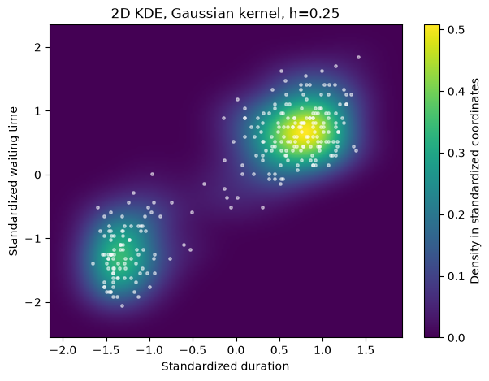
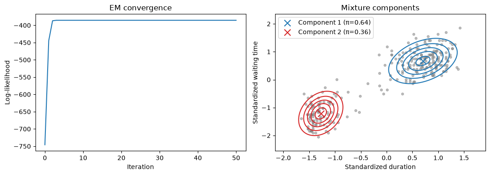
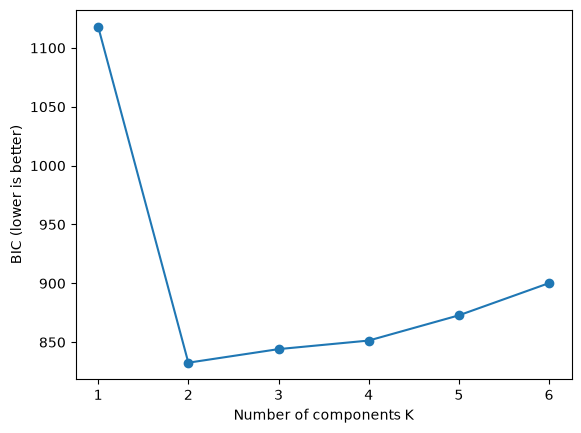
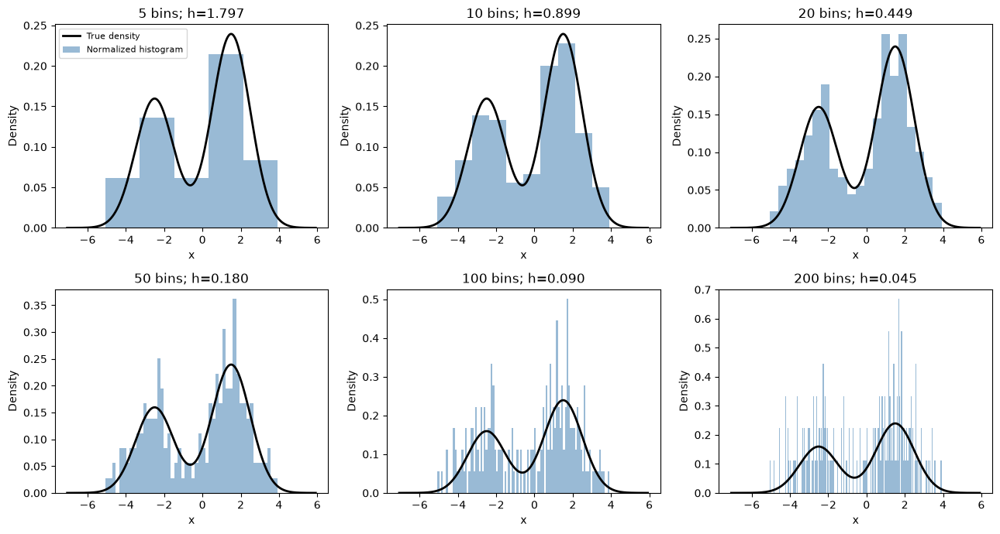
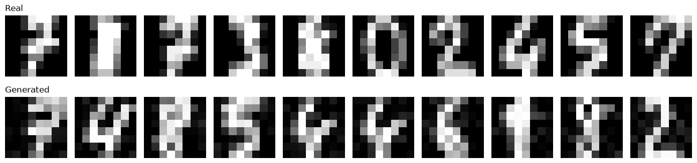

# Statistical estimation: EM and kernel density estimation

Two labs from the Introduction to Statistical Estimation course at Centrale Lille: fitting Gaussian mixtures with an EM algorithm written from scratch, then estimating densities without a parametric model, from 1D histograms up to a 64-dimensional generative model of handwritten digits.



## Highlights

- **EM algorithm from scratch** for a Gaussian mixture, with a numerically stable log-likelihood (`logsumexp`) and a monotone convergence check (largest decrease at machine precision).
- **Initialization study** over 10 random seeds: EM can stop in a local optimum (log-likelihood −381.8 vs −374.4 for K=3).
- **Model selection by BIC**: K=2 components is optimal on Old Faithful (BIC 832.6 vs 844.1 for K=3), with the free-parameter count derived analytically.
- **Kernel density estimation** in 1D and 2D: bias-variance trade-off of the bandwidth, comparison of six kernels, and a KDE sampler that generates new 8×8 digit images.

## Contents

| Lab | Topic | Main concepts |
|---|---|---|
| [Lab 1](lab1/lab1.ipynb) | EM algorithm and Gaussian mixture model | log-likelihood, E and M steps, initialization, BIC, clustering |
| [Lab 2](lab2/lab2.ipynb) | Kernel density estimation | histograms, bias and variance, Parzen-Rosenblatt estimator, bandwidth, 2D KDE, generative sampling |

## Repository layout

```text
.
├── lab1/
│   ├── lab1.ipynb          # EM and Gaussian mixture
│   └── oldfaithful.npy     # Old Faithful geyser data (272 eruptions)
├── lab2/
│   ├── lab2.ipynb          # Kernel density estimation
│   └── oldfaithful.npy     # same data, so that each lab runs on its own
├── docs/                   # Figures used in this README
└── requirements.txt
```

## Run it

```bash
pip install -r requirements.txt
jupyter notebook lab1/lab1.ipynb
```

Open each notebook from its own folder and run the cells in order. All outputs and figures are saved, so the notebooks can be read without running them.

## Context

Coursework for the Introduction to Statistical Estimation course, Centrale Lille. The lab statements were provided by the teaching staff; the answers, code and analysis are my own. More on my [portfolio](https://ugo-roccamatisi.github.io).

## Gallery

| | |
|---|---|
|  |  |
|  |  |
